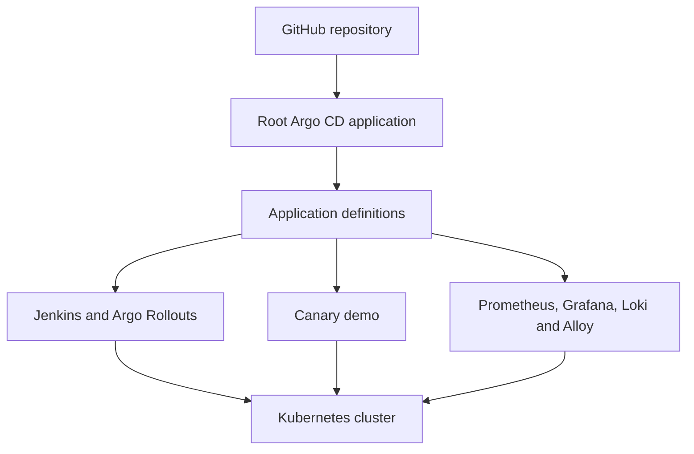

# Jenkins Argo CD Lab

A hands-on GitOps lab that uses Argo CD to deploy and manage a Jenkins environment, progressive delivery, and an observability stack on Kubernetes.

The repository is organized around the **App-of-Apps** pattern. A root Argo CD application discovers the application definitions under `apps/`, and Argo CD continuously reconciles the desired state stored in Git with the resources running in the cluster.

## What this lab demonstrates

- GitOps-based Kubernetes application delivery with Argo CD
- Centralized application management using the App-of-Apps pattern
- Jenkins deployment and lifecycle management through Git
- Canary releases with Argo Rollouts
- Automated analysis during progressive delivery
- Metrics collection and visualization with Prometheus and Grafana
- Log aggregation with Loki and Alloy
- Recovery of the platform from the Git repository

## Architecture



## Applications

| Application | Purpose |
| --- | --- |
| Argo CD | GitOps controller and application management interface |
| Keycloak | OIDC identity provider; single sign-on for the platform UIs |
| Jenkins | Continuous integration server managed through Argo CD |
| Argo Rollouts | Kubernetes controller for progressive delivery |
| Canary Demo | Demonstrates a canary rollout with automated analysis |
| Prometheus | Collects platform and application metrics |
| Grafana | Visualizes metrics and operational data |
| Loki | Stores and queries Kubernetes logs |
| Alloy | Collects and forwards telemetry to the observability stack |

## Repository structure

```text
.
├── apps/
│   ├── alloy/
│   ├── argo-rollouts/
│   ├── canary-demo/
│   │   └── manifests/
│   ├── grafana/
│   ├── jenkins/
│   ├── loki/
│   └── prometheus/
└── README.md
```

Each directory under `apps/` contains an Argo CD `Application` definition. The canary demo also contains its Kubernetes manifests, including the Rollout, services, ingress, and analysis configuration.

## How it works

1. Argo CD is installed in the Kubernetes cluster.
2. The root application is applied to Argo CD.
3. Argo CD discovers the application definitions stored under `apps/`.
4. Each application is deployed into its target namespace.
5. Argo CD monitors Git and reports whether the live resources are synchronized and healthy.
6. Changes committed to Git become the desired state and are reconciled into the cluster.

## Prerequisites

- A Kubernetes cluster
- `kubectl`
- Git
- Argo CD
- Access to this repository

The lab can run on a local Kubernetes environment such as K3s, Kind, or another compatible cluster.

## Getting started

Clone the repository:

```bash
git clone https://github.com/brunobml/jenkins-argo.git
cd jenkins-argo
```

Install Argo CD in the cluster, then apply the repository's root application manifest. Argo CD will create and manage the child applications defined under `apps/`.

> Exact bootstrap commands may vary according to the cluster and the root application manifest used by the lab. Detailed installation and recovery instructions will be added in dedicated documentation pages.

## Verifying the lab

Check the Argo CD applications:

```bash
kubectl get applications -n argocd
```

Check the workloads across all namespaces:

```bash
kubectl get pods -A
```

For the canary demo, inspect the rollout with the Argo Rollouts plugin:

```bash
kubectl argo rollouts get rollout canary-demo -n canary-demo
```

A completed rollout may retain older failed `AnalysisRun` resources as history. This is expected; the current Rollout status is the primary indicator of whether the active release is healthy.

## Single sign-on

Keycloak (`apps/keycloak/`) runs as one of the platform applications and provides
OIDC login for Argo CD, Grafana, Jenkins and Argo Workflows. The `platform` realm,
its clients and seed users are imported from Git on every start. See
[bootstrap/README.md](bootstrap/README.md#sso-with-keycloak) for URLs, users and
the group-to-role mapping.

## Disaster recovery concept

The Git repository is the source of truth for the platform configuration. A replacement cluster can be prepared by installing Argo CD and reapplying the root application. Argo CD then recreates the applications and Kubernetes resources declared in Git.

This restores the declared platform configuration, but it does not automatically restore persistent application data. Data backup and recovery must be handled separately for stateful workloads.

## Planned documentation

Future pages can provide focused procedures for:

- Argo CD installation and bootstrap
- App-of-Apps configuration
- Jenkins deployment and access
- Argo Rollouts and the canary demo
- Prometheus and Grafana
- Loki and Alloy
- Disaster recovery
- Troubleshooting and common operational commands

## Status

This repository is a learning environment and is expected to evolve as new GitOps, CI/CD, progressive-delivery, and observability scenarios are added.

## Repository

[github.com/brunobml/jenkins-argo](https://github.com/brunobml/jenkins-argo)