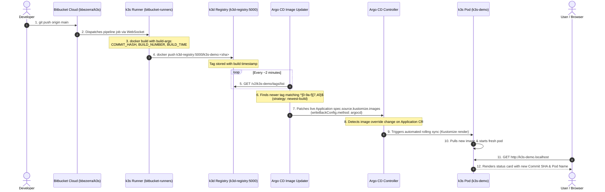

# k3s-demo — Automated CI/CD with Bitbucket Pipelines & Argo CD

An end-to-end GitOps delivery loop combining a self-hosted **Bitbucket Pipelines Runner** on local k3s, an in-cluster **Docker Registry**, and **Argo CD Image Updater**.

Every push to branch `main` in the Bitbucket repository automatically builds, publishes, and rolls out a new release to `http://k3s-demo.localhost` with zero manual steps.

---

## Architecture & Chain of Events



---

## Detailed Component Breakdown

### 1. Build & Push (Bitbucket Pipelines)
- **Repository**: `git@bitbucket.org:bbezerra/k3s.git`
- **Configuration**: `bitbucket-pipelines.yml` (`branches: main:`)
- **Execution**: Runs on the in-cluster runner (`runs-on: [self.hosted, linux, k3s]`) in namespace `bitbucket-runners`.
- **Image Metadata**: The pipeline injects pipeline metadata into the Docker build:
  ```bash
  docker build \
    --build-arg COMMIT_HASH="${SHORT_HASH}" \
    --build-arg BUILD_NUMBER="${BITBUCKET_BUILD_NUMBER}" \
    --build-arg BUILD_TIME="${BUILD_TIME}" \
    -t "k3d-registry:5000/k3s-demo:${SHORT_HASH}" \
    -t "k3d-registry:5000/k3s-demo:latest" .
  ```
- **Registry Destination**: Pushed to the local k3d registry (`k3d-registry:5000`).

### 2. Registry Polling (Argo CD Image Updater)
- **Manifest**: [`manifests/image-updater.yaml`](manifests/image-updater.yaml)
- **Registry Monitored**: `k3d-registry:5000/k3s-demo`
- **Tag Filter**: `allowTags: "regexp:^[0-9a-f]{7,40}$"` (matches 7-to-40 character git commit SHAs, ignoring mutable tags like `latest` or `test`).
- **Selection Strategy**: `updateStrategy: newest-build` (inspects registry manifest creation dates to select the newest build).

### 3. Write-Back: `method: argocd` vs `method: git`
- `k3s-demo` uses **`writeBackConfig.method: argocd`**.
- Instead of committing back to `jenkins-argo` on GitHub, Image Updater patches the live Argo CD `Application` resource in Kubernetes directly:
  ```yaml
  spec:
    source:
      kustomize:
        images:
          - k3d-registry:5000/k3s-demo=k3d-registry:5000/k3s-demo:<new-sha>
  ```
- **Why this matters**:
  - ⚡ **No Git pollution**: Avoids generating hundreds of automated "bump image tag" commits in your Git history.
  - 🔒 **Zero GitHub credentials needed**: Does not require GitHub Personal Access Tokens or write permissions.
  - 🚀 **Immediate reconciliation**: Argo CD detects the live spec change and synchronizes immediately.

### 4. Root ApplicationSet Protection (`ignoreApplicationDifferences`)
In `apps/platform/applicationset.yaml`, the `platform` ApplicationSet includes:
```yaml
ignoreApplicationDifferences:
  - name: k3s-demo
    jsonPointers:
      - /spec/source/kustomize/images
```
Without this rule, the parent ApplicationSet generator would detect that the live `Application` has a kustomize image override not present in Git and revert it back to the seed tag. With `ignoreApplicationDifferences`, the ApplicationSet ignores this field, letting Image Updater manage it freely.

### 5. Runtime Webhook & Pod Introspection
- **Build Time**: `sed` bakes `COMMIT_HASH`, `BUILD_NUMBER`, and `BUILD_TIME` into `/app/index.html`.
- **Runtime**: `entrypoint.sh` executes `$(hostname)` inside the pod and dynamically replaces `{{POD_NAME}}`.
- The lightweight server serves the page over port 8080:
  ```bash
  while true; do
    printf 'HTTP/1.1 200 OK\r\nContent-Type: text/html; charset=UTF-8\r\nConnection: close\r\n\r\n' | cat - /tmp/index.html | nc -l -p 8080
  done
  ```

---

## File Structure

```text
apps/k3s-demo/
├── README.md                          # This documentation
├── kustomization.yaml                 # Kustomize root (tracks seed tag)
└── manifests/
    ├── deployment.yaml                # Deployment (runs image & exposes port 8080)
    ├── service.yaml                   # ClusterIP service (port 80 -> 8080)
    ├── ingress.yaml                   # Traefik ingress for k3s-demo.localhost
    └── image-updater.yaml             # ImageUpdater CR for argocd-image-updater
```

---

## Useful Verification Commands

### Check live image on the deployment:
```bash
kubectl get deployment k3s-demo -n k3s-demo -o jsonpath='{.spec.template.spec.containers[0].image}'
```

### Check Image Updater logs:
```bash
kubectl logs deploy/argocd-image-updater-controller -n argocd --tail=30
```

### Check live Application image override:
```bash
kubectl get application k3s-demo -n argocd -o jsonpath='{.spec.source.kustomize.images}'
```

### Query the web page:
```bash
curl -s http://k3s-demo.localhost | grep -E "hash|Build Number|Built At|Serving Pod"
```
